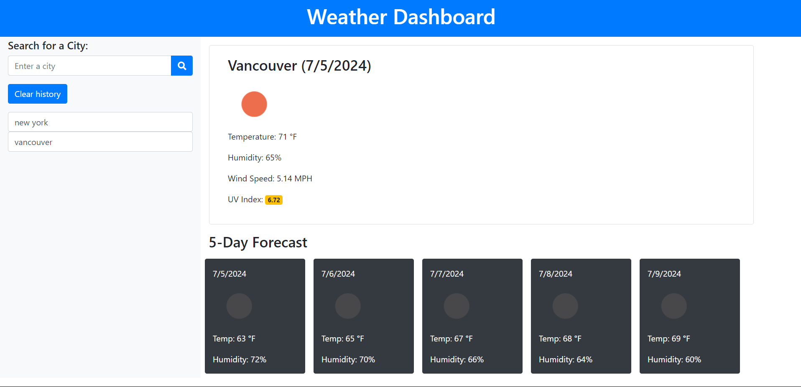
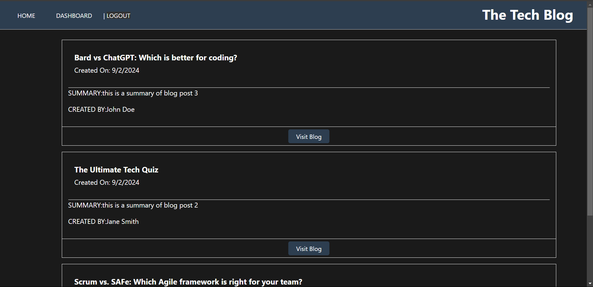
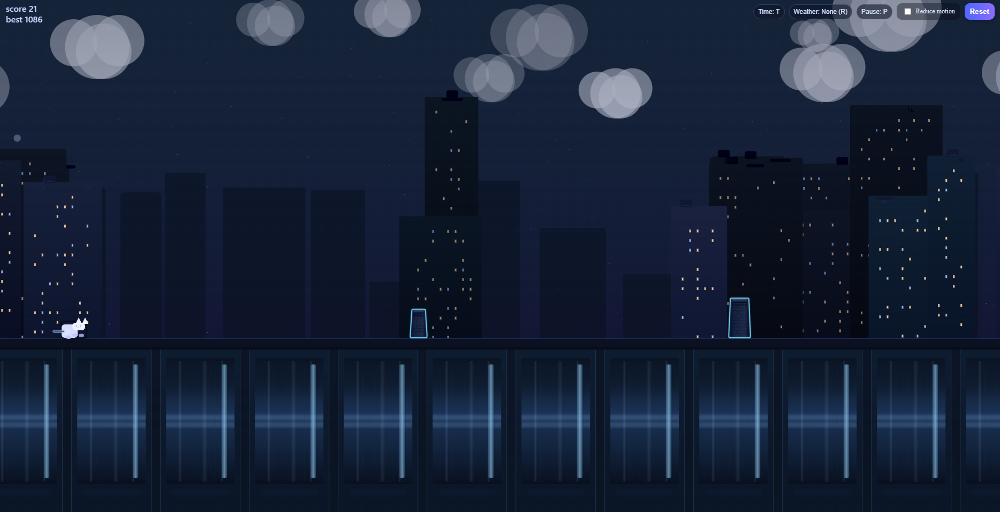
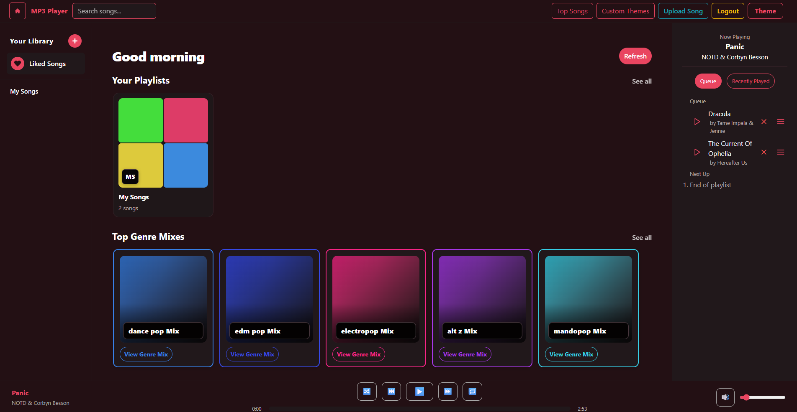

# portfolio-using-react
My professional developer portfolio built using React.js to showcase projects, technical skills, and application demos.

## Description
This project is a responsive React-based portfolio web application designed to display my development projects and work samples. It provides employers and collaborators with an easy way to explore my applications, view project previews, and access repositories or live deployments.

## Live App Link
[Live Link](https://portfolio-using-react-azat.onrender.com)

# Featured Projects
## Weather Dashboard
[Live Link](https://acespadee.github.io/Weather-dashboard/) | [Repository](https://github.com/AceSpadee/Weather-dashboard)
 

 
A weather forecasting application that allows users to search for cities and view current weather conditions along with a multi-day forecast. The application retrieves data from an external weather API and dynamically updates the interface based on user searches.

Technologies: JavaScript, API Integration, HTML, CSS

## Tech Blog Website
[Live Link](https://tech-blog-website-775s.onrender.com) | [Repository](https://github.com/AceSpadee/Tech-Blog-website)
 

 
A full-stack blogging platform where users can create accounts, publish posts, and interact with other users through comments. The application demonstrates authentication, database interaction, and server-side rendering.

Technologies: Node.js, Express.js, Handlebars, MySQL

## Rooftop Cat
[Live Link](https://ambient-loader.onrender.com) | [Repository](https://github.com/AceSpadee/ambient-loader)
 

 
A browser-based endless runner inspired by the Google Chrome dinosaur game. Players control a rooftop cat that must dodge neon obstacles while trying to survive as long as possible. The project focuses on game logic, timing, and DOM-based animation.

Technologies: JavaScript, HTML, CSS, React

## Music Player
Private Project, Frontend is hosted
 
[Live Link](https://music-player-s59b.onrender.com)
 

 
A Spotify-inspired web music player that allows users to browse tracks, control playback, and view album artwork in a modern interface. The project focuses on building a responsive media player UI and implementing audio playback controls within a React application.

Technologies: React.js, JavaScript, CSS

 ## License

 

 This project is licensed under the [MIT License](https://choosealicense.com/licenses/mit/) license.

 ## Queries

 GitHub: https://github.com/AceSpadee